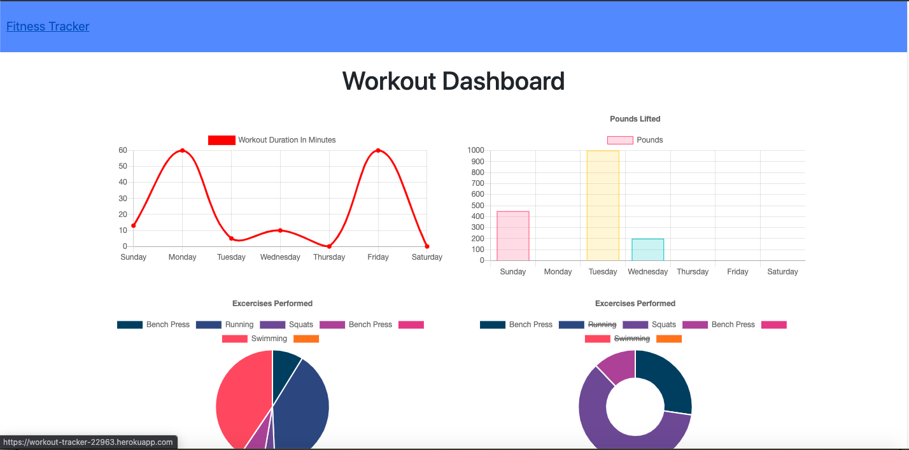
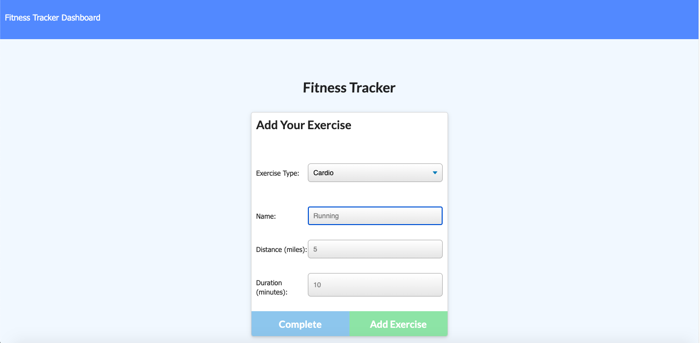

# Workout Tracker
Full-stack app that uses node, express, MongoDB, and Mongoose.

[](https://opensource.org/licenses/MIT)
  
## Description
Full-stack web application used to track workout routines and view workout history. The app uses vanilla JavaScript, node.js, an Express server, a MongoDB database, and Mongoose ODM. 

## Table of Contents
* [Installation](#Installation)
* [Usage](#Usage)
* [Images](#Images)
* [Contributing](#Contributing)
* [Credits](#Credits)
* [License](#License)
* [Questions](#Questions)

## Installation
* Clone the repo [here](http://www.github.com/jameygronewald/workoutTracker) and run  ```npm install```
* Once you have repo cloned and dependencies installed, run  ```node server.js``` in the command line to start server on localhost:3000.

## Usage
1. View the deployed app [here](https://workout-tracker-22963.herokuapp.com/).
2. Main page shows stats for you last workout, or a prompt to add one if you do not have any workouts logged. 
3. Click "Dashboard" to view workout stats.
4. Click "New Workout" to begin logging a new workout, or click "Continue Workout" to log additional exercises to the current workout.

## Images

### Screenshots




## Contributing
I am the sole contributor on this project.

## Credits
Thanks to GT Coding Bootcamp for providing front-end code and project description.

## License
MIT License

Copyright (c) [2020] [Jamey Gronewald]

Permission is hereby granted, free of charge, to any person obtaining a copy
of this software and associated documentation files (the "Software"), to deal
in the Software without restriction, including without limitation the rights
to use, copy, modify, merge, publish, distribute, sublicense, and/or sell
copies of the Software, and to permit persons to whom the Software is
furnished to do so, subject to the following conditions:

The above copyright notice and this permission notice shall be included in all
copies or substantial portions of the Software.

THE SOFTWARE IS PROVIDED "AS IS", WITHOUT WARRANTY OF ANY KIND, EXPRESS OR
IMPLIED, INCLUDING BUT NOT LIMITED TO THE WARRANTIES OF MERCHANTABILITY,
FITNESS FOR A PARTICULAR PURPOSE AND NONINFRINGEMENT. IN NO EVENT SHALL THE
AUTHORS OR COPYRIGHT HOLDERS BE LIABLE FOR ANY CLAIM, DAMAGES OR OTHER
LIABILITY, WHETHER IN AN ACTION OF CONTRACT, TORT OR OTHERWISE, ARISING FROM,
OUT OF OR IN CONNECTION WITH THE SOFTWARE OR THE USE OR OTHER DEALINGS IN THE
SOFTWARE.

## Questions
Please direct any questions to jrgronewald@gmail.com, or visit the GitHub repository at https://github.com/jameygronewald/workoutTracker.